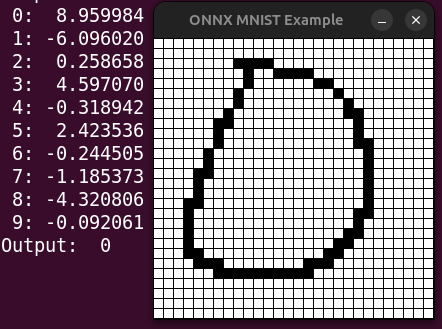

# Examples for ONNX Runtime

1. MNIST - the handwriting recognition

   1. Download the model from https://github.com/microsoft/onnxruntime-inference-examples/tree/main/c_cxx/MNIST

          curl -LO https://github.com/microsoft/onnxruntime-inference-examples/raw/main/c_cxx/MNIST/mnist.onnx

   2. Build examples with `alr build`
   3. Run `./bin/mnist`. It will recognize an embedded image:

          Result: 7

   To simplify the source code we don't provide image loading, but
   recognize an image buffer embedded into the source instead.

2. ljspeech - TTS (text-to-speech)

   1. Download the model from
      https://huggingface.co/NeuML/ljspeech-jets-onnx
   2. Run `./bin/ljspeech`. It will generate a speech into
      `test.wav`. The text is embedded into the source code
      as a token sequence. It was created by
      https://github.com/neuml/ttstokenizer.

3. SDL/MNIST - an interactive MNIST example using SDL for user input.
   The operator can draw on the model input surface using the mouse:

   - **Left click**: Draw model input point
   - **Right click**: Clear model input

   

   1. Download the model from https://github.com/microsoft/onnxruntime-inference-examples/tree/main/c_cxx/MNIST

          curl -LO https://github.com/microsoft/onnxruntime-inference-examples/raw/main/c_cxx/MNIST/mnist.onnx

   2. Build examples with `alr -C examples/SDL build`
   3. Run `./examples/SDL/bin/mnist_sdl`. Use the mouse to draw a digit.

